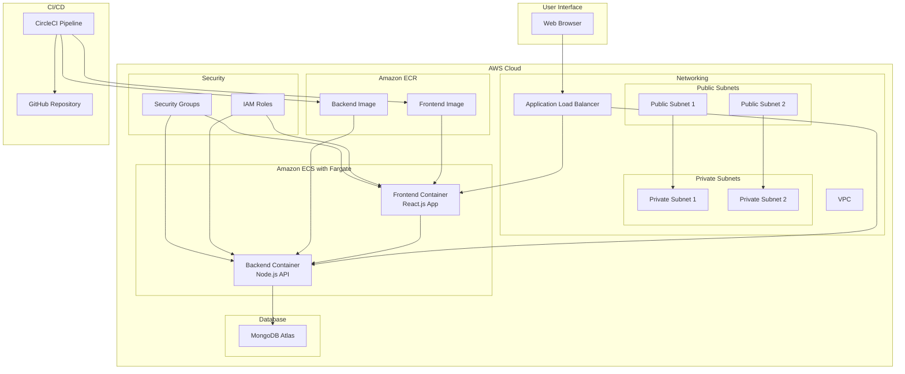

# Quiz Application Architecture

## System Architecture Diagram

## Component Details

### Frontend Container
- React.js application
- Context API for state management
- Responsive UI components
- JWT token handling
- API integration

### Backend Container
- Node.js + Express API
- RESTful endpoints
- JWT authentication
- MongoDB integration
- Business logic

### AWS Infrastructure
1. **ECS/Fargate**
   - Serverless container management
   - Auto-scaling capabilities
   - Task definitions and services

2. **Networking**
   - VPC with public/private subnets
   - Application Load Balancer
   - Security groups and NACLs

3. **Security**
   - IAM roles and policies
   - VPC endpoints
   - SSL/TLS encryption

### CI/CD Pipeline
1. **Source Control**
   - GitHub repository
   - Branch protection rules
   - Code review process

2. **CircleCI**
   - Automated testing
   - Docker image building
   - AWS deployment
   - Environment management 