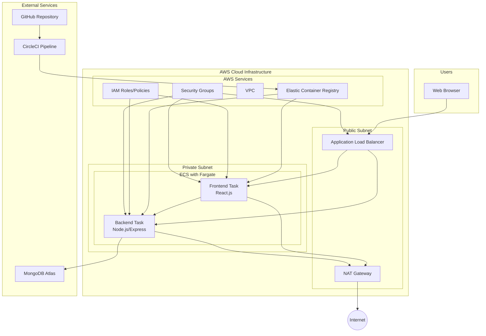

# Quiz Application - Detailed Architecture

## System Architecture Diagram

## Component Details

### Frontend (React.js)
- Single-page application
- Context API for state management
- Protected routes
- JWT token handling
- Responsive design

### Backend (Node.js/Express)
- RESTful API
- JWT authentication
- MongoDB integration
- Input validation
- Error handling

### AWS Infrastructure
1. **VPC Configuration**
   - Public subnet for ALB
   - Private subnet for containers
   - NAT Gateway for outbound traffic
   - Security groups for access control

2. **ECS/Fargate**
   - Serverless container management
   - Auto-scaling capabilities
   - Task definitions for both services
   - Service discovery

3. **Load Balancer**
   - Application Load Balancer (ALB)
   - SSL/TLS termination
   - Route traffic to containers
   - Health checks

4. **Security**
   - IAM roles and policies
   - Security groups
   - Network ACLs
   - SSL/TLS encryption

### CI/CD Pipeline
1. **GitHub**
   - Source code repository
   - Version control
   - Branch protection

2. **CircleCI**
   - Automated testing
   - Docker image building
   - AWS deployment
   - Environment management

3. **ECR**
   - Container registry
   - Image versioning
   - Secure image storage

### Database
- MongoDB Atlas
- Secure connection
- Data persistence
- Schema validation 