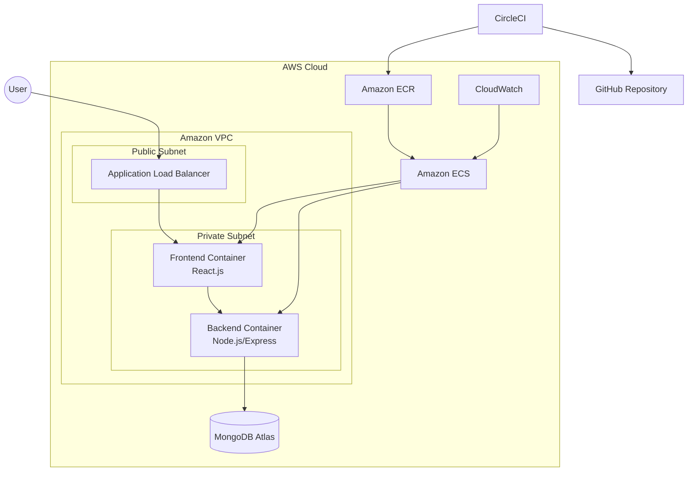

```mermaid
graph TB
    User((User)) --> ALB[Application Load Balancer]
    
    subgraph AWS Cloud
        subgraph VPC[Amazon VPC]
            subgraph Public[Public Subnet]
                ALB
            end
            
            subgraph Private[Private Subnet]
                Frontend[Frontend Container<br/>React.js]
                Backend[Backend Container<br/>Node.js/Express]
            end
        end
        
        ECR[Amazon ECR]
        ECS[Amazon ECS]
        CW[CloudWatch]
        
        ALB --> Frontend
        Frontend --> Backend
        Backend --> MongoDB[(MongoDB Atlas)]
        
        ECR --> ECS
        ECS --> Frontend
        ECS --> Backend
        CW --> ECS
    end
    
    CI[CircleCI] --> ECR
    CI --> GitHub[GitHub Repository]
``` 